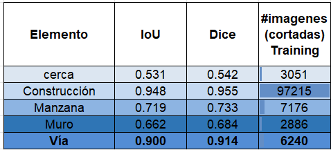

# U-Net para Detección de elementos de catastro

Este repositorio contiene un ejemplo de implementación del algoritmo U-Net para la detección de vías, construcciones, cercas, muros y remoción en masas en imágenes satelitales. 
El modelo U-Net es una arquitectura de red neuronal convolucional muy utilizada en tareas de segmentación semántica.

## Contenido

- [Requisitos](#requisitos)
- [Fuente](#Fuente-Conjunto-de-datos)
- [Ejemplos](#Ejemplos)
- [Diagrama de Arquitectura](#diagrama-de-arquitectura)
- [Métricas](#Métricas)

## Requisitos

- Python 3.x
- Bibliotecas de Python: segmentation-models-pytorch==0.2.1, albumentations, ipywidgets, geopandas, leafmap, localtileserver

## Diagrama de Arquitectura
https://pub.mdpi-res.com/remotesensing/remotesensing-12-01544/article_deploy/html/images/remotesensing-12-01544-g001.png)

## Fuente Conjunto de datos
•	Imágenes satelitales RGB de 10 a 50 cms de resolución espacial. Fuente: Colombia en imágenes, IGAC

## Ejemplo conjunto de datos de entrenamiento

## Métricas
Las métricas IoU y Dice indican la precisión deeste tipo de algoritmos

