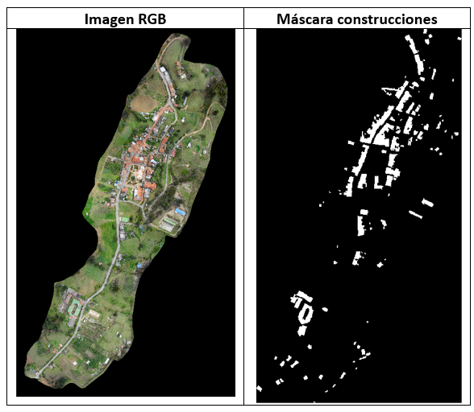

# U-Net para Detección de elementos de catastro

Este repositorio contiene un ejemplo de implementación del algoritmo U-Net para la detección de vías, construcciones, cercas, muros, manzanas y remoción en masas en imágenes satelitales. 
El modelo U-Net es una de las arquitecturas de red neuronal convolucional más utilizadas en tareas de segmentación semántica.

## Contenido

- [Requisitos](#Requisitos)
- [Fuente](#Fuente-Conjunto-de-datos)
- [Ejemplos](#Ejemplos)
- [Diagrama de Arquitectura](#diagrama-de-arquitectura)
- [Reconocimientos](#Reconocimientos)

## Requisitos
•	Python 3.x
•	Bibliotecas de Python

## Diagrama de Arquitectura

## Fuente Conjunto de datos
•	Imágenes aéreas tipo Ultracam:
    Capas: RGB 
    Resolución espacial: 10 cms (urbano), 50 cms (rural)
    Dtype: unit8
    Fuente: Colombia en imágenes, IGAC
    

## Ejemplo conjunto de datos de entrenamiento

## Reconocimiento
El entrenamiento y la detección del modelo se hizo usando la arquitectura UNET:
  U-Net: Convolutional Networks for Biomedical Image Segmentation
  Medical Image Computing and Computer-Assisted Intervention – MICCAI 2015, 2015, Volume 9351
  ISBN : 978-3-319-24573-7
  Olaf Ronneberger, Philipp Fischer, Thomas Brox

